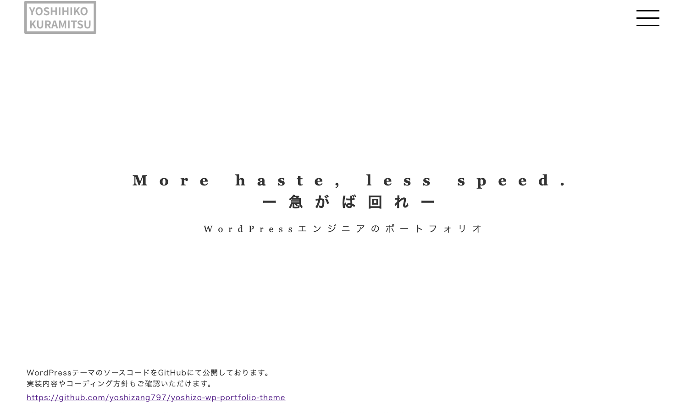

# Yoshihiko Portfolio WordPress Theme

## ■ Overview
This repository contains a custom WordPress theme developed for my portfolio site.

The theme is built from scratch with a focus on:
- clean structure
- maintainability
- responsive design

It is designed to support **safe improvements and ongoing maintenance of existing websites**.

---

## ■ Preview

## ■ Features
- Custom WordPress theme (no pre-built theme used)
- SCSS-based styling workflow
- Responsive design (mobile-first approach)
- Simple and maintainable file structure
- Built with consideration for future updates and modifications

---

## ■ Tech Stack
- HTML / CSS / SCSS
- JavaScript (basic interactions)
- WordPress (PHP)
- Git / GitHub

---

## ■ What I Do
- Layout implementation from design
- Responsive adjustments
- Fixing layout issues (HTML / CSS)
- WordPress theme customization and modification

---

---

## ■ Workflow
1. Write styles in SCSS
2. Compile to CSS
3. Build as WordPress theme
4. Manage versions with Git
5. Deploy to production

---

## ■ Strengths
- Ability to improve existing WordPress sites without breaking functionality
- Focus on stability and maintainable code
- Suitable for maintenance, fixes, and incremental updates

---

## ■ Note
This theme is used for my personal portfolio and is continuously being improved.

---

## ■ 日本語補足
既存サイトを壊さず、着実に改善するWeb制作をテーマに開発しています。
## ■ Project Structure (Simplified)
Initial Git commit test.
